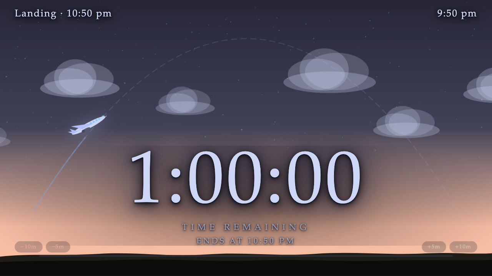
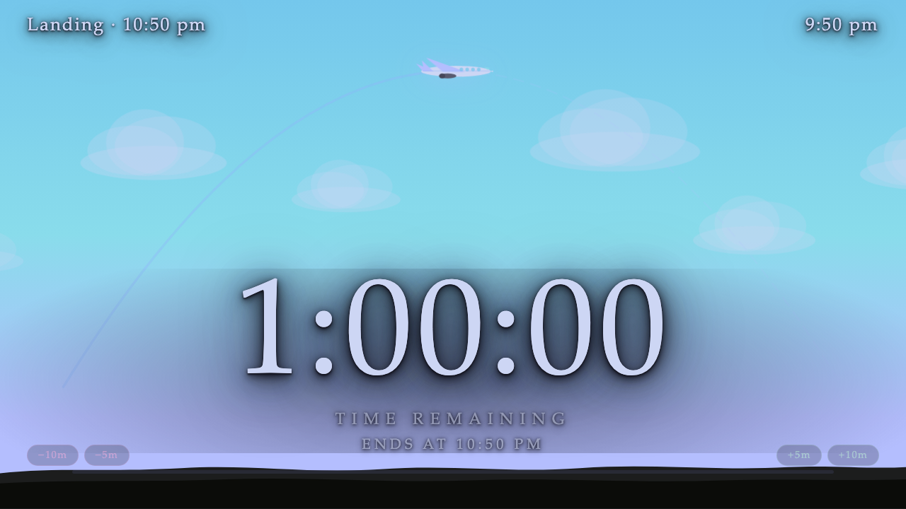
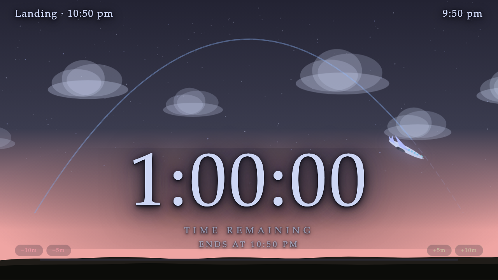

<div align="center">

# ✈ flight timer

*a relaxing exam timer for the projector*

[](https://github.com/catppuccin/catppuccin)
[](index.html)
[](index.html)

</div>

---

<table>
<tr>
<td></td>
<td></td>
<td></td>
</tr>
<tr>
<td align="center"><sub>dawn</sub></td>
<td align="center"><sub>midday</sub></td>
<td align="center"><sub>dusk</sub></td>
</tr>
</table>

---

A plane takes off, arcs through a full day of sky, and lands exactly when time runs out. Set a duration, hit **Begin Flight**, and let your students watch the clock — without watching the clock.

<br>

## ☀️ the sky tells the time

The sky, light, and plane position all move together in real time.

| progress | scene |
|:---:|---|
| `0%` | deep night — stars out, engine idling on the setup screen |
| takeoff | sunrise blooms as the plane climbs from the left |
| `50%` | bright midday blue at the peak of the arc |
| descent | golden hour as the plane begins to drop |
| `100%` | darkness falls — *time's up · pens down* |

<br>

## 🚀 getting started

Double-click `index.html` — no installation, no internet, no server required.

> **Projector tip:** go fullscreen with `F11` on Windows/Linux or `⌘ Ctrl F` on Mac for the full effect.

<br>

## 🎛️ controls

| input | action |
|---|---|
| presets or `hr / min / sec` inputs | set the duration |
| **Begin Flight** | launches the timer |
| `Escape` | reset at any time |
| `[` &nbsp;/&nbsp; `]` | −5 min / +5 min while running |
| `−10m` `−5m` `+5m` `+10m` | on-screen buttons in the bottom corners |

<br>

## 🖥️ reading the hud

```
Landing · 2:45 pm                          3:22 pm
                       1:23:45
                   time remaining
                  ends at 2:45 pm
−10m  −5m                              +5m  +10m
━━━━━━━━━━━━━━━━━━━━━━━━━━━━━━━━━━━━━━━━━━━━━━━━
```

The landing time lives in the top-left so students always know the end time at a glance.

<br>

---

<div align="center">
<sub>built with 🩷 and <a href="https://github.com/catppuccin/catppuccin">catppuccin mocha</a></sub>
</div>
